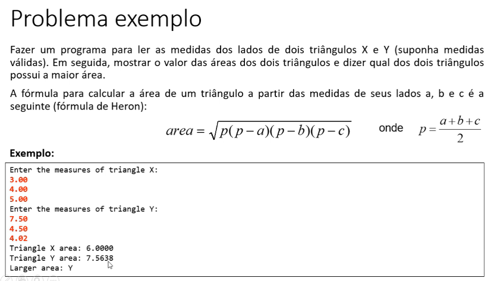

# 🔺 Cálculo de Área de Triângulos em Java (POO)

Este projeto foi desenvolvido como parte do meu **treinamento em Programação Orientada a Objetos (POO)** durante o **estágio na SULTS**, utilizando o curso [**Java COMPLETO – Programação Orientada a Objetos + Projetos**](https://www.udemy.com/course/java-curso-completo/).

---

## 🎯 Objetivo do Projeto

O objetivo deste aplicativo é **resolver um problema matemático utilizando Programação Orientada a Objetos**, comparando a **área de dois triângulos**.

O programa permite:

* Informar os lados de dois triângulos (X e Y)
* Calcular a área de cada um usando um método
* Comparar as áreas
* Informar qual triângulo possui a maior área

Tudo isso aplicando **POO e reutilização de código através de métodos**.

---

## 🧠 Conceitos de POO Aplicados

✔️ Classes e Objetos

✔️ Atributos

✔️ Métodos

✔️ Encapsulamento básico

✔️ Separação de responsabilidades

✔️ Organização em pacotes

---

## 🛠️ Tecnologias Utilizadas

* ☕ **Java**
* 📚 **Programação Orientada a Objetos**
* 🖥️ **Entrada de dados via console (Scanner)**

---

## 📌 Estrutura do Projeto

### 🔹 Classe `Triangulo`

Representa um triângulo do mundo real, contendo:

* Atributos `a`, `b` e `c` (lados do triângulo)
* Método `area()` responsável por calcular a área usando a **fórmula de Heron**

Essa classe **encapsula a lógica do cálculo**, deixando o código mais organizado e reutilizável.

---

### 🔹 Classe `Main`

Responsável por:

* Ler os dados do usuário
* Criar dois objetos do tipo `Triangulo`
* Chamar o método `area()` para cada triângulo
* Comparar as áreas calculadas
* Exibir o resultado no console

---

## 🔄 Enunciado do Programa

---

## 🚀 Aprendizados

Com este projeto foi possível reforçar:

* Como **modelar problemas reais usando classes**
* Como **métodos encapsulam comportamentos**
* A importância da **POO para organizar lógica**
* Como evitar código duplicado
* Uso prático de **objetos para resolver problemas matemáticos**

---

## 👨‍💻 Autor

**Yuri Duarte**

Estagiário na **SULTS**

Treinamento em **Java e Programação Orientada a Objetos**

---